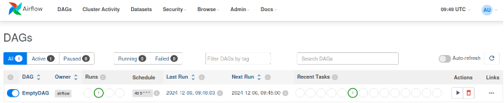
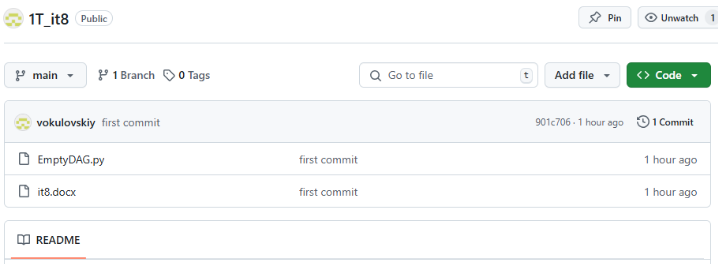

**Задание 8. Развертывание Apache Airflow в Minikube и создание простого DAG**

**Цель: Научиться разворачивать Apache Airflow в Kubernetes с использованием Minikube и создавать простой Directed Acyclic Graph (DAG) для автоматизации задач.**

Описание задания:

- Запустите Minikube с достаточными ресурсами.
- Установите Helm, если он еще не установлен.
- Добавьте репозиторий Apache Airflow.
- Создайте пространство имен для Airflow.
- Используем Helm для развертывания Airflow с базовыми настройками.
- Получите URL для доступа к веб-интерфейсу Airflow.
- Создайте DAG и подложите его в git (как это показывалось в лекционном материале).
- В DAG создайте 2 любых оператора. Запуск DAG — ежедневный в 12:45 по Москве.

В качестве решения необходимо сделать отчет, в котором видно Ваш DAG в git, а также видно DAG в Airflow. Обязательно сделайте скрин вашего DAG в работе, что он отбежал.

Результат задания — после выполнения задания у вас будет развернутая в Minikube среда Apache Airflow, где вы сможете создавать и управлять DAG для автоматизации задач. 

\# Выкладываем код в репозиторий git

#################### EmptyDAG.py ####################################

from airflow import DAG

from airflow.operators.empty import EmptyOperator

from datetime import datetime

default\_args = {

'owner': 'airflow',

'depends\_on\_past': False,

'start\_date': datetime(2024, 12, 6),

'email\_on\_failure': False,

'email\_on\_retry': False,

}

dag = DAG(

dag\_id='EmptyDAG',

default\_args=default\_args,

description='A simple tutorial DAG',

schedule\_interval='45 9 \* \* \* ',

catchup=False

)

t1 = EmptyOperator(

task\_id='dummy\_task',

retries=3,

dag=dag,

)######################################################################

\# Для того, чтобы настроить Apache Airflow, для minikube нужно выделить 8GB и 4 ядра.

minikube start --driver=docker --memory 8g --cpus 4

minikube status

kubectl get pods -A

kubectl get pod -o wide

\# добавление репозитория.

helm repo add apache-airflow https://airflow.apache.org

helm repo update

helm install airflow apache-airflow/airflow \

--debug \

--namespace airflow \

--create-namespace \

--set dags.gitSync.enabled=true \

--set dags.gitSync.repo=https://github.com/vokulovskiy/1T\_it8 \

--set dags.gitSync.branch=main \

--set dags.gitSync.subPath="/"

kubectl get pods -n airflow

kubectl get svc airflow-webserver

kubectl port-forward svc/airflow-webserver 8888:8080 --namespace airflow

